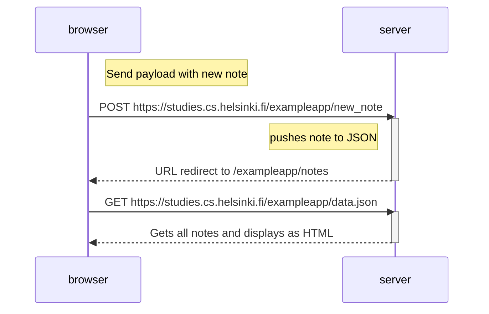

```mermaid
sequenceDiagram
    participant browser
    participant server

    Note right of browser: Send payload with new note
    browser->>server: POST https://studies.cs.helsinki.fi/exampleapp/new_note
    activate server
    Note left of server: pushes note to JSON
    server-->>browser: URL redirect to /exampleapp/notes

    deactivate server

    browser->>server: GET https://studies.cs.helsinki.fi/exampleapp/data.json
    activate server
    server-->>browser: Gets all notes and displays as HTML
    deactivate server

```
